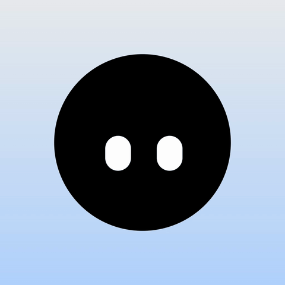

<p align="center">
  <picture>
    <source media="(prefers-color-scheme: dark)" srcset="https://shieldcn.dev/header/glow.svg?title=Agent+Notch&subtitle=LLM+usage%2C+in+your+Mac%27s+notch&logo=https://raw.githubusercontent.com/itslucadev/AgentNotch/main/AgentNotch/Assets.xcassets/AppIcon.appiconset/icon_128.png&theme=zinc&mode=dark" />
    
  </picture>
</p>

<p align="center">
  <a href="https://github.com/itslucadev/AgentNotch/releases">
    <picture>
      <source media="(prefers-color-scheme: dark)" srcset="https://shieldcn.dev/github/release/itslucadev/AgentNotch.svg?variant=secondary&mode=dark" />
      
    </picture>
  </a>
  <a href="https://github.com/itslucadev/AgentNotch/stargazers">
    <picture>
      <source media="(prefers-color-scheme: dark)" srcset="https://shieldcn.dev/github/stars/itslucadev/AgentNotch.svg?variant=secondary&mode=dark" />
      
    </picture>
  </a>
  <a href="https://lucabecker.dev/agent-notch">
    <picture>
      <source media="(prefers-color-scheme: dark)" srcset="https://shieldcn.dev/badge/macOS-26+-blue.svg?logo=apple&variant=secondary&mode=dark" />
      
    </picture>
  </a>
  <picture>
    <source media="(prefers-color-scheme: dark)" srcset="https://shieldcn.dev/badge/Swift-6-orange.svg?logo=swift&variant=secondary&mode=dark" />
    
  </picture>
</p>

A native side notch that shows how much of your Claude, Cursor and Codex limits you have used, so you find out before the rate limit does. It reads the sign-ins those tools already keep on your Mac and never asks for one of its own.

<p align="center">
  
</p>

## Features

- **Three rings, one glance.** Claude, Cursor and Codex limits as rings on the edge of your screen. Green, yellow and red tell you how close you are before a session stalls.
- **Hover for the full picture.** Every window with its reset time, plus the Claude Code sessions running right now. Click a ring to refresh it.
- **Never signs in.** Switch accounts in the tool and the notch follows.
- **Lives where you want it.** Right, left, top or bottom edge. Keep it open, collapse it to a pill that opens on hover, or hide it completely.

## Download

[Get Agent Notch](https://lucabecker.dev/agent-notch) or grab the zip from [Releases](https://github.com/itslucadev/AgentNotch/releases/latest).

Requires macOS 26 or later, and Claude Code, Cursor or Codex signed in on this Mac. macOS will ask once whether Agent Notch may read Claude Code's keychain item; choose Always Allow and it stays quiet. Notarized by Apple. Updates itself.

## Build

```bash
open AgentNotch.xcodeproj
```

Or from the command line:

```bash
xcodebuild -project AgentNotch.xcodeproj -scheme AgentNotch -configuration Debug -destination 'platform=macOS' build
```

## Credits

Rebuilt from Codenotch by Vinz, whose idea this is.
